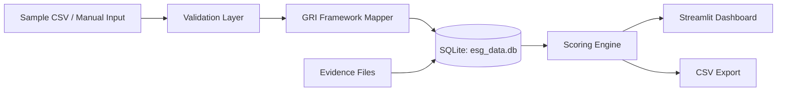

# ESG Data Collector


A Streamlit app for collecting and scoring ESG data across suppliers and project sites — with GRI framework alignment, evidence upload, and automated scoring.

---

## Architecture



---

## Quick Start

1. Clone the repository:
   ```bash
   git clone https://github.com/achmadnaufal/esg-data-collector.git
   cd esg-data-collector
   ```

2. Install dependencies:
   ```bash
   pip install -r requirements.txt
   ```

3. Launch the app:
   ```bash
   streamlit run app.py
   ```

---

## Features

- Collect ESG metrics across Environmental, Social, and Governance dimensions
- GRI (Global Reporting Initiative) framework alignment for standardized disclosures
- Evidence file upload per metric with persistent storage
- Automated ESG scoring with visual dashboards
- Supplier and project site management
- Exportable reports in CSV format
- Audit trail for data submissions

---

## Usage

Load the bundled sample dataset (25 ESG assessments across 12 Indonesian companies) into the local SQLite database:

```bash
python demo/load_sample_data.py
```

Real captured output:

```
Loading data from: demo/sample_data.csv

Read 25 rows from CSV
CSV validation passed

Initializing GRI indicators...
  Initialized 13 GRI indicators
Loading suppliers...
  Loaded 12 unique suppliers
Loading assessments...
  Loaded 25 assessments

============================================================
SUMMARY STATISTICS
============================================================
Total Suppliers: 12
Total Assessments: 25

Score Statistics:
  Average: 78.16
  Minimum: 68.00
  Maximum: 88.00

Assessments by Category:
  Economic: 2 assessments, avg 79.00
  Environmental: 10 assessments, avg 73.70
  Governance: 2 assessments, avg 87.00
  Social: 11 assessments, avg 80.45
============================================================

SUCCESS: Data loading completed!
```

Then launch the dashboard with `streamlit run app.py` to explore scores by supplier, category, and GRI indicator.

---

## Sample Output


> If the screenshot is not available, run locally with `streamlit run app.py` to see the app in action.

---

## Tech Stack

| Layer | Technology |
|-------|------------|
| Frontend / UI | Streamlit |
| Data Processing | Pandas |
| Visualizations | Plotly |
| Database | SQLite (via esg_data.db) |
| Testing | Pytest + pytest-cov |
| Language | Python 3.9+ |

---

## Project Structure

```
esg-data-collector/
├── app.py                  # Main Streamlit entry point
├── requirements.txt        # Python dependencies
├── LICENSE                 # MIT license
├── README.md               # Project documentation
├── .gitignore              # Git ignore rules
├── .streamlit/
│   └── config.toml         # Streamlit theme and server config
├── src/
│   ├── collectors/         # ESG data collection modules
│   ├── scorers/            # Automated scoring logic
│   ├── models/             # Data models and schemas
│   └── utils/              # Shared utilities
├── docs/
│   └── SCREENSHOTS.md      # App screenshots reference
├── demo/                   # Demo data and examples
└── tests/                  # Unit and integration tests
```

---

## License

This project is licensed under the MIT License. See the [LICENSE](LICENSE) file for details.

---

> Built by [Achmad Naufal](https://github.com/achmadnaufal) | Lead Data Analyst | Power BI · SQL · Python · GIS
